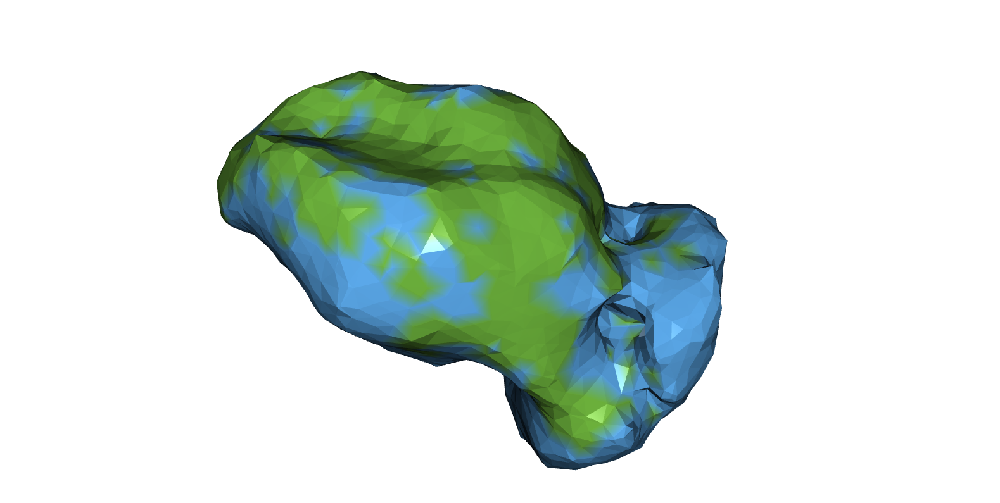
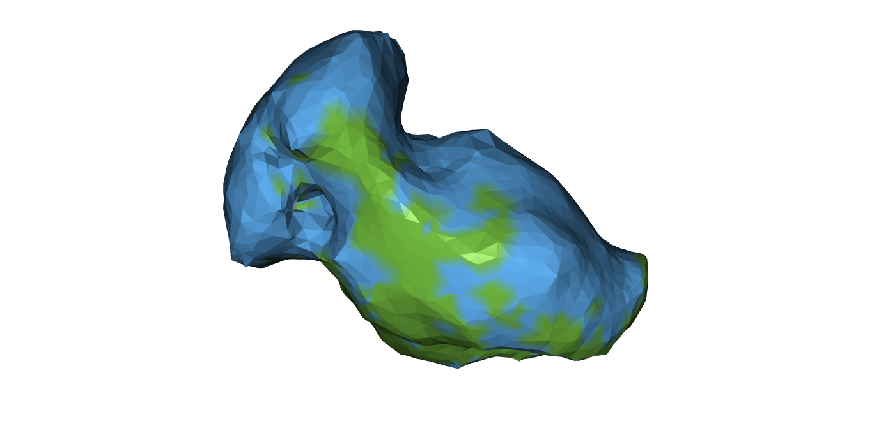
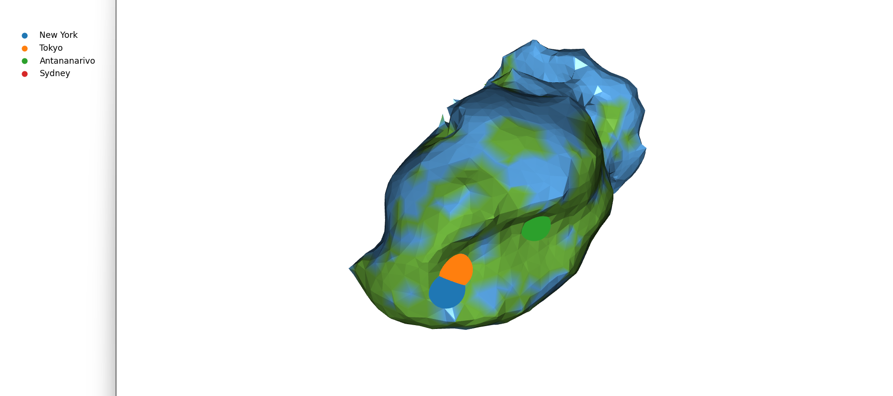
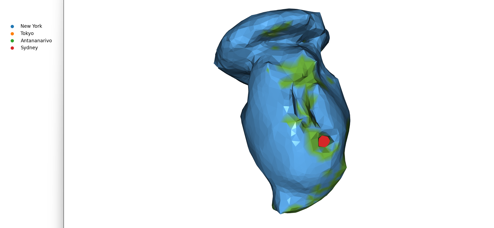

# Chronofora: See the World through the Eyes of Google Maps

## Introduction

This project provides a framework to reshape a closed 2D surface in 3D so that geodesic distances (the shortest path between two points along the deformed surface) reflect a custom distance metric. In other words, it constructs a 2D surface in 3D whose intrinsic geometry (geodesic distances) is quasi-isometric to a given metric space.

  
  

__Motivating example__: I wanted to deform the Earth (represented as a unit sphere) so that distances on the deformed surface represent travel times between locations. To give you an idea, in terms of fastest accessible transportation, from New York it takes 6-7h to get to Paris, while it takes 2-3 days to get to the middle of the Atlantic Ocean. So on the deformed version of the Earth, the geodesic distance (meaning, the shortest distance on the surface) between what are supposed to be New York and Paris is much smaller than the distance to the middle of the Atlantic Ocean. As you might have guessed, __Chronofora__ (the title of the project) is the tentative name I have given to this new Earth-potato planet (feel free to let me know if you have any better ideas).

  

__A reason why that is only an approximation in practice__: You might also have guessed that this problem does not seem to have a solution: for instance, we can safely assume that on Earth, all the points equidistant to NY and Paris are further away in terms of transportation time from either of them than the other city. With this in mind, if there existed an accurate deformation of the Earth, it would necessarily violate continuity, and therefore not be a deformation as intended. This is one of the reasons why the embedding constructed is _quasi_-isometric rather than perfectly isometric.

Originally, the aim of this project is mainly artistic. But beyond providing some cool and fun shapes, it also stands as an algorithm to visualize how given metrics can distort 2D surfaces in 3D, which may prove useful in some more concrete cases: it could help visualize brain connectivity where neural pathway strengths define distances between regions, or diffusion processes on surfaces where propagation time rather than geometric distance is the relevant metric. And as far as I know, there are no other algorithms in the literature which seem to tackle this visualization problem, as all classical visualization methods assume a flat Euclidean target space.

This is only a first version of Chronofora at this stage (there is a lot of room for improvement), but please let me know what you think!

  
  

## Features and Project Structure

The main part of the project resides in __get_mesh.py__. This script loads the Chronofora data, asks which cities you'd like to see plotted on the surface, and opens visualization windows to explore the geometry.

The rest of the project is structured as such:
- __get_X_transportation_geometry.py__ processes open-source transportation datasets (flight, train, ferry, car) to compute transportation times between fixed "transportation stations";
- __get_X_geometry.py__ proposes a heuristic method to compute multimodal travel times between arbitrary global locations, and then computes the pairwise distances of a regular sample of N points on Planet Earth;
- __surface_spring_system.py__ builds the object necessary to deform the surface -- a large-scale spring (and "superspring") system, with some additional constraints to keep the 2D aspect of the surface -- and __run_spring.py__ runs the simulation;
- __map_utils.py__ provides some utiliary functions.

__A note on accuracy__: You may notice some geometric inconsistencies in the result. Remember, this problem has no perfect solution — Chronofora represents a "best possible" approximation in a specific optimization sense. Additionally, some parameters were chosen to favor the visual appeal of the shape over strict accuracy. As a result, you might find pairs of points that are unusually close (or far) on Chronofora despite their actual travel times suggesting otherwise. This is subject to improvement.

## More technical paper

To follow.

## Future improvements

Off the top of my mind, some areas for improvement are:
- _visualization interface_: making an easier interface for visualization;
- _modular structure_: building a more modular structure where one could directly provide surface and custom distances, beyond the context of Chronofora;
- _shape regularity_: some measure of the coolness of the shape to regularize the loss function;
- _better optimization_: minimizing the loss function through optimizers rater than physics-simulation;
- _direct surface deformation_: stepping away from the point cloud approach (as of now, we are simply deforming a point cloud associated to the original surface, with some additional constraints to ensure a plausible surface, and then trying to fit a surface to it - this 3-step procedure (original surface -> original point cloud -> deformed point cloud -> deformed surface) surely accumulates noise).

## Acknowledgments

The idea for this project actually originated a few years back, when I was interning at GeomStats under the supervision of Nina Miolane (UC Santa Barbara) and Alice Le Brigant (Université Paris Panthéon Sorbonne). Professor Andrew Blumberg (Columbia University) also helped me a lot in approaching the problem. 
